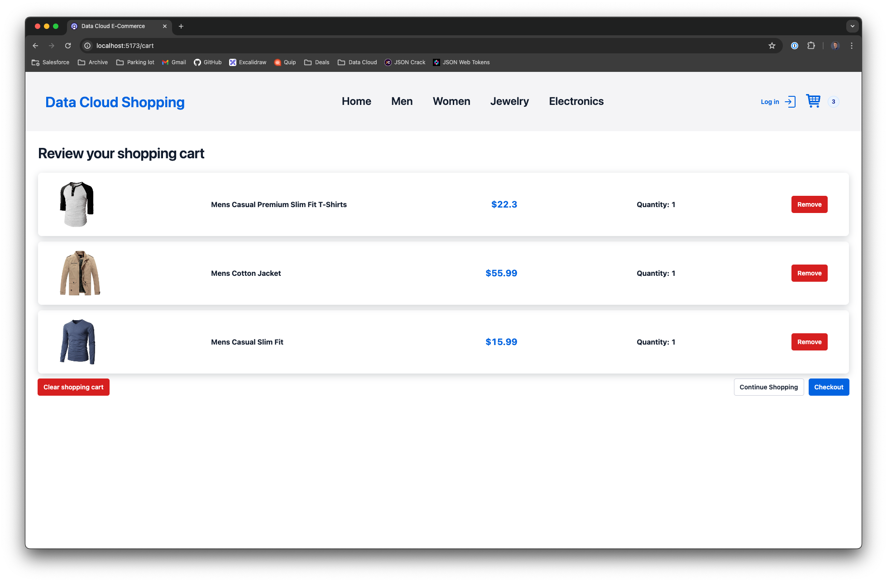

<p align="center">
<p align="center">
<a  href="https://www.salesforce.com/"></a>
<a href="https://www.salesforce.com/data/"></a>
<a href="https://react.dev/"></a>
<p/>
<p/>

# Data Cloud E-Commerce Web Tracking

This project is a simple React web application built with Vite that uses the Salesforce Data Cloud SDK to track web events. It is a proof of concept (POC) that was used for learning and testing out the SDK capabilities.

# Table of Contents

- [Data Cloud E-Commerce Web Tracking](#data-cloud-e-commerce-web-tracking)
- [Table of Contents](#table-of-contents)
  - [What does it do?](#what-does-it-do)
  - [Architecture diagram](#architecture-diagram)
  - [E-Commerce Application Demo](#e-commerce-application-demo)
  - [Landing page](#landing-page)
  - [Home](#home)
  - [Men](#men)
  - [Women](#women)
  - [Jewelry](#jewelry)
  - [Electronics](#electronics)
  - [Cart](#cart)
  - [Not found](#not-found)
  - [Script configuration](#script-configuration)
  - [Technologies used](#technologies-used)
- [Configuration](#configuration)
  - [Requirements](#requirements)
  - [Setup](#setup)
    - [Development](#development)
    - [Deployment](#deployment)
- [Kudos](#kudos)
- [License](#license)
- [Disclaimer](#disclaimer)

---

## What does it do?

This application loads various e-commerce products from the [FakeStore API](https://fakestoreapi.com/), displays them across various categories, allows users to view items, add and remove items from cart, view a cart, clear the cart, simulate a checkout, and simulate a login flow.

In addition to the above, this application loads the [Salesforce Data Cloud SDK](https://developer.salesforce.com/docs/atlas.en-us.c360a_api.meta/c360a_api/c360a_api_connect_data.htm) and tracks the following web events:

- when a user looks at an item
- when a user adds an item to the cart
- when a user removes item from the cart
- when a user clear their cart completely
- when a user logs in
- when a user logs out
- when a user completes his order
- which pages the user navigated

## Architecture diagram


The application is built with React so it is a Single Page Application (SPA) that connects to the FakeStore API to fetch data asynchronously. The fetched data are various e-commerce products that are then filtered and displayed to the user in various categories.

In the header of the page, there is a [settings/cog icon](#script-configuration) that opens a modal window. In there you can paste your Data Cloud tenant endpoint for the JavaScript file to be loaded onto the page. Once you click on **Save changes**, the Data Cloud JavaScript file will be fetched from the CDN and added into the `<script>` tag and added to the `window` object. This logic is executed by the [useScript](/src/components/hooks/useScript.ts) hook.

Once you save your script URL, it will then be saved to your browser's local storage. On application load, the application will check the browser local storage for an existing script. This is done so you don't have to re-enter the script tag every time you open the application or refresh a page.

**NOTE**: The purpose behind the settings option is to allow developers to easily install this application and add your Data Cloud tenant endpoint with ease.

To track various events aforementioned previously, a custom react hook was created called [useSalesforceInteractions](/src/components/hooks/useSalesforceInteractions.ts) that returns an object with various event tracking functions.

Throughout the application, the various event tracking functions are used that send the tracking data to your [Data Cloud tenant specific endpoint](https://help.salesforce.com/s/articleView?id=sf.c360_a_tenant_specific_endpoint.htm&type=5).

**NOTE**: This application does not use [Salesforce sitemap](https://developer.salesforce.com/docs/atlas.en-us.c360a_api.meta/c360a_api/c360a_api_sitemap.htm). Instead, all events are tracked in the react application itself.

## E-Commerce Application Demo


## Landing page


## Home


## Men


## Women


## Jewelry


## Electronics


## Cart



## Not found


## Script configuration


## Technologies used

- [Vite](https://vitejs.dev/)
- [React](https://react.dev/)
- [Zustand](https://github.com/pmndrs/zustand)
- [FakestoreAPI](https://fakestoreapi.com/)
- [Twilio Paste](https://paste.twilio.design/)
- [React router](https://reactrouter.com/en/main)
- [Typescript](https://www.typescriptlang.org/)
- [Data Cloud SDK](https://developer.salesforce.com/docs/atlas.en-us.c360a_api.meta/c360a_api/c360a_api_connect_data.htm)

For a more detailed overview of the development & production dependencies, please check `package.json`.

# Configuration

## Requirements

To run this application locally and successfully stream data to Data Cloud, you will need the following:

- An active Salesforce account with Data Cloud provisioned
- Node.js version 20 or later installed (type `node -v` in your terminal to check). Follow [instructions](https://nodejs.org/en/download) if you don't have node installed
- npm version 10.0.0 or later installed (type `npm -v` in your terminal to check). Node.js includes `npm`

## Setup

The first step is to clone the GitHub project and install the project dependencies via a terminal interface by running the `npm install` in the proper folder:

```
cd salesforce-data-cloud-ecommerce
npm install
```

The second step is to connect your website to Data Cloud. The instructions can be found in the [official documentation here](https://developer.salesforce.com/docs/data/data-cloud-ref/guide/c360a-api-salesforce-interactions-web-sdk.html).

The schema document for this web application is located in the `utils` folder. You can download the schema from [here](./salesforce/web-connector-schema.json).

The third step in this process is to create the appropriate data streams in Data Cloud. To do so, please follow the [official documentation here](https://help.salesforce.com/s/articleView?id=sf.c360_a_create_a_mobile_web_data_stream.htm&type=5).

### Development

To run the application locally, use the command line, navigate to the folder, ensure the dependencies are installed properly, and run the following:

```
cd salesforce-data-cloud-ecommerce
npm run dev
```

This will automatically run the Vite development server. Your app will run on `http://localhost:5173` by default.

When you make changes to your code, the browser window will be automatically refreshed.

### Deployment

Once you are happy with your application, you can deploy it!

From your command line, navigate to the application folder and build your application.

```
cd salesforce-data-cloud-ecommerce
npm build
```

By default, it uses `<root>/index.html` as the build entry point, and produces an application bundle that is suitable to be served over a static hosting service. For more details on the build step, visit the [official documentation](https://vitejs.dev/guide/build.html).

# Kudos

This project was inspired by [Custom Threads](https://github.com/developedbygeo/Custom-threads) repository.

# License

[MIT](http://www.opensource.org/licenses/mit-license.html)

# Disclaimer

This software is to be considered "sample code", a Type B Deliverable, and is delivered "as-is" to the user. Salesforce bears no responsibility to support the use or implementation of this software.
